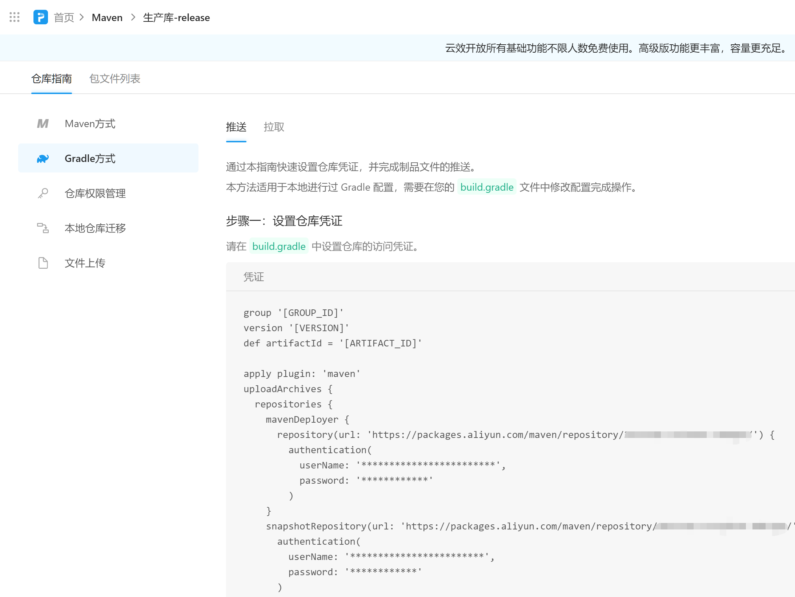

# 如何发布Android Library到阿里云的私有Maven仓库中

使用AS开发Android应用的同学一定不陌生引入三方库时像下面这样的要加到 build.gradle 中的依赖关系声明：

```groovy
dependencies {
    implementation "androidx.appcompat:appcompat:1.3.1"
    ……
}

```


而如果我们自己开发的库也想这样引用的话，需要把我们的库模块利用 maven 插件（Gradle 7.0以下） 或者 maven-publish 插件（Gradle 7.0及以上）打包发布到一个maven仓库中。

这里就以阿里云提供的免费私有Maven库为例。

打开阿里云的云效Packages官网：https://packages.aliyun.com/maven

注册登录后，点开生产库-release的页面，切换到 仓库指南 这页，可以看到配置的方法




如果你的项目目前用的**Gradle版本是7.0以下的**，那么就照着页面里的做法修改脚本并执行即可。

但需要注意，配置项中的这三项需要把单引号改成双引号：

```groovy
      pom.version = "$project.version"
      pom.artifactId = "$artifactId"
      pom.groupId = "$project.group"
```


而如果你的项目用的**Gradle版本是7.0及以上的**，那么按照官方的说明，原来的maven插件是已经被移除了，所以需要对阿里云提供的模板改动进行调整。

以下是调整完毕后的适配与Gradle 7.0及以上版本的模板改动，你可以参考着来修改里面的参数后执行任务来把aar发布到阿里云的私有Maven仓库上：

```
group '[GROUP_ID]'
version '[VERSION]'
def pubArtifactId = '[ARTIFACT_ID]'

apply plugin: 'maven-publish'

afterEvaluate() {
    publishing  {
        publications  {
            releaseAar(MavenPublication) {
                // Applies the component for the release build variant.
                from components.release

                // You can then customize attributes of the publication as shown below.
                groupId = "$project.group"
                artifactId = "$pubArtifactId"
                version = "$project.version"
            }
        }
        repositories {
            maven {
                name "release"
                url = "https://packages.aliyun.com/maven/repository/你的私有release库地址/"
                credentials {
                    setUsername('原模板上的用户名')
                    setPassword('原模板上的密码')
                }
            }
            maven {
                name "snapshot"
                url = "https://packages.aliyun.com/maven/repository/你的私有snapshot库地址/"
                credentials {
                    setUsername('原模板上的用户名')
                    setPassword('原模板上的密码')
                }
            }
        }
    }
}
```


上面这个例子中我声明了releaseAar这个版本的产物，并且有release和snapshot这两个仓库，所以如果我直接执行以下命令的话，会往两个仓库都推送release版本的产物：

```bash
./gradlew publish
```

即等价于串行执行了以下命令：

```bash
./gradlew publishReleaseAarPublicationToReleaseRepository

./gradlew publishReleaseAarPublicationToSnapshotRepository
```

所以对于只想往其中一个仓库推送产物的情形，请按以下Pattern执行特定任务即可，而不是直接执行publish任务：

publish***PubName***PublicationTo***RepoName***Repository


参考资料：

1. https://discuss.gradle.org/t/plugin-with-id-maven-not-found/39621
2. https://docs.gradle.org/7.0/userguide/publishing_maven.html#publishing_maven:deferred_configuration
3. https://developer.android.com/studio/build/maven-publish-plugin?hl=zh-cn#groovy
4. https://docs.gradle.org/current/dsl/org.gradle.api.artifacts.repositories.MavenArtifactRepository.html#N2B923
5. https://docs.gradle.org/current/samples/sample_publishing_credentials.html